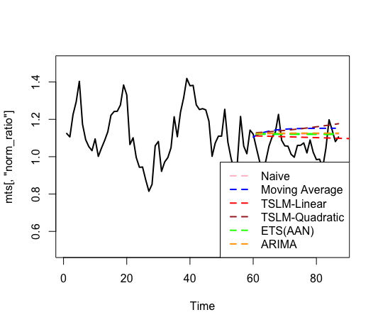

# Marriott Room Forecasting

This repository hosts the code and associated data for a comprehensive analysis and forecasting of room bookings for Marriott hotels. The primary goal of this project is to utilize historical booking data to predict future room demands accurately, which aids in managing room availability and optimizing revenue from bookings.

## Project Overview

The forecasting process in this project involves multiple statistical and machine learning methods to analyze and predict hotel room bookings. Accurate forecasting is vital for optimizing room availability, pricing strategies, and ensuring customer satisfaction in the hotel industry.

### Forecasting Models Used
- **Naive Forecast**: This simple model assumes that the demand for rooms tomorrow will be the same as today.
- **Moving Average**: Helps in understanding trends by averaging the room bookings over a predefined past period.
- **Time Series Linear Model (TSLM)**: A linear regression approach adapted for time series data, which includes trends and seasonal components.
- **ARIMA**: An advanced forecasting model that leverages autocorrelations and moving averages of differenced data to predict future values.
- **Exponential Smoothing State Space Model (ETS)**: Applies exponential smoothing techniques to make forecasts considering error, trend, and seasonality.

## Dependencies

The project requires R and several specific packages, which are essential for statistical modeling and data visualization:

- `ggplot2`: For creating informative visualizations.
- `tidyverse`, `dplyr`: For data manipulation and transformation.
- `rio`: For easy data import/export in various formats.
- `forecast`: Provides methods for automatic ARIMA modeling and exponential smoothing.
- `zoo`: Offers infrastructure for regular and irregular time series data.

## Detailed Steps in the Project

### Data Importing and Preparation
- **Data Loading**: Utilizes `rio::import()` combined with `dplyr::as_tibble()` for a streamlined approach to load and convert the dataset. It’s crucial to verify that the dataset filename matches the script.
- **Data Normalization**: Normalizes the `pickup_ratio` with `dow_index` to adjust for day-of-the-week effects, enhancing the reliability of the forecasting models.

### Time Series Creation
- **Date Sequencing**: Constructs a sequence of dates that should be associated with the time series object (`mts`). This ensures the time index is correctly set up, aligning data points with their respective dates for accurate time series analysis.

### Forecasting and Model Building
- **Model Implementation**: Includes naive, moving average, TSLM (linear and polynomial), ARIMA, and ETS models.
- **Non-stationarity Handling**: Ensures the time series data are stationary before applying ARIMA or ETS models, which is crucial for the accuracy of these models.

### Plotting and Evaluation
- **Visualization**: Employs `ggplot2` for plotting, comparing forecasts from different models against actual data.

### Handling of Differenced Data
- **Differencing**: Applies differencing to manage trends and non-stationarity in the time series data.
- **Back-Transformation**: Uses `diffinv()` for correctly re-transforming the differenced forecasts back to their original scale.

## Forecasting Model Comparisons

Below is a visualization of the performance of different forecasting models used in this project. The plot illustrates how each model's predictions compare against the normalized pickup ratio time series.

